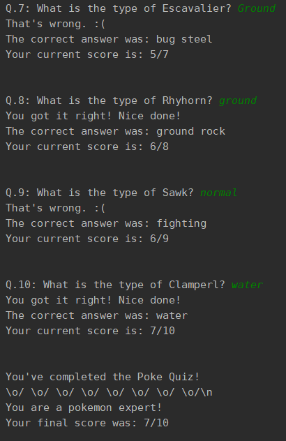

  <a href="www.linkedin.com/in/marcoauréliopedroza/">
      Linkedin</a>

<a href="mailto:marco.aurelio.p@hotmail.com">
 &nbsp; E-mail</a>

# Quiz Game - Pokemon :snake:

- Object-oriented Programming Project:

  - This project was build in python

  - The data used in this project came from [Pokemondb](https://pokemondb.net/pokedex/game/x-y) (Web Scraping)
  - I used a [Class](./poke_question.py) to build a dynamic quiz game
  - And [Another Class](./poke_type_answer) for organizing the question structure

- Libraries:
  - Requests
  - BeautifulSoup
  - Pandas
  - Time
  - Random

- Output:

    

